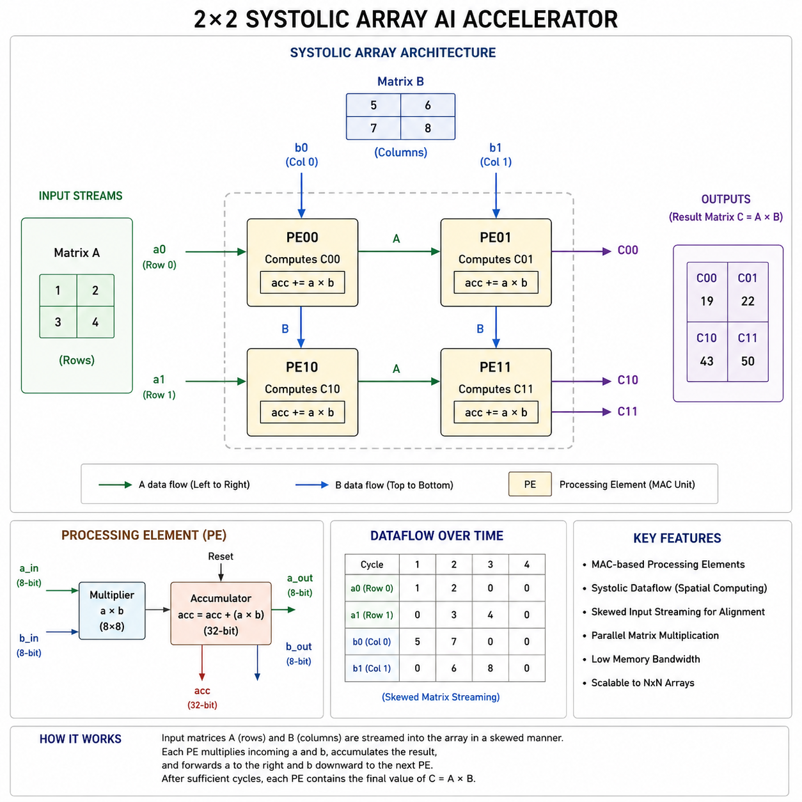

# Tiny AI Accelerator — 2x2 INT8 Systolic Array in Verilog

A simple AI accelerator prototype implementing a 2x2 systolic-array matrix multiplication architecture using Verilog HDL.

## Features

- INT8 MAC-based Processing Elements (PEs)
- 2x2 systolic array architecture
- Parallel matrix multiplication
- Skewed matrix streaming
- Temporal data alignment
- GTKWave simulation verification
- Fully synthesizable RTL

---

## Architecture



Each Processing Element performs:

acc = acc + (a × b)

Data propagation:
- A values move horizontally
- B values move vertically

This mimics real systolic-array AI accelerators used in modern NPUs and TPUs.

---

## Project Structure

```text
rtl/
    pe.v
    systolic_2x2.v

tb/
    pe_tb.v
    systolic_2x2_tb.v
```

---

## Matrix Multiplication Example

Input:

| A | B |
|---|---|
| [1 2] | [5 6] |
| [3 4] | [7 8] |

Output:

| C |
|---|
| [19 22] |
| [43 50] |

---

## Simulation

Compile:

```bash
iverilog -o sim/systolic_out rtl/pe.v rtl/systolic_2x2.v tb/systolic_2x2_tb.v
```

Run:

```bash
vvp sim/systolic_out
```

Open GTKWave:

```bash
gtkwave sim/systolic_2x2.vcd
```

---

## Key Learnings

- Systolic-array architectures
- MAC-based compute fabrics
- Parallel dataflow
- Temporal synchronization
- Skewed matrix streaming
- Hardware acceleration concepts

---

## Future Improvements

- Parameterized NxN arrays
- SRAM buffering
- AXI interface
- CNN convolution engine
- Quantized inference pipeline
- FPGA deployment
